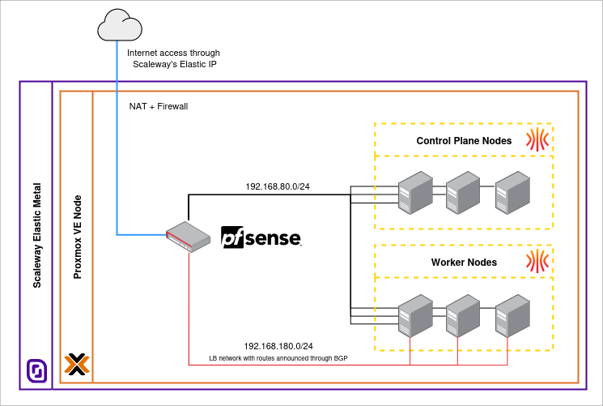

# k8s-talos-linux-labs

This repository contains the files and documentation related to Camptocamp's R&D project to gain experience with Talos Linux deployments.

> [!NOTE]
> Although we tried to keep good documentation and good practices in mind, do not consider this repository as a production-ready solution. It is meant for educational purposes and to share knowledge.
>
> Additionally, the documentation is not a complete guide/tutorial, but rather a collection of steps and tips to help us document our experience with Talos Linux.

## Table of contents

- [k8s-talos-linux-labs](#k8s-talos-linux-labs)
  - [Table of contents](#table-of-contents)
  - [Infrastructure configuration](#infrastructure-configuration)
    - [Proxmox VE preparations](#proxmox-ve-preparations)
    - [Network configuration](#network-configuration)
    - [Architecture overview](#architecture-overview)
  - [Talos Linux installation](#talos-linux-installation)
    - [Requirements](#requirements)
    - [Download image](#download-image)
    - [Creation of a template VM](#creation-of-a-template-vm)
    - [Creation of the basic machine configuration](#creation-of-the-basic-machine-configuration)
    - [Understanding the nodes](#understanding-the-nodes)
    - [Create machine configuration patches](#create-machine-configuration-patches)
    - [Install Talos Linux on the nodes](#install-talos-linux-on-the-nodes)

## Infrastructure configuration

This document outlines the steps to configure the infrastructure for Talos Linux deployments using Proxmox VE.

> [!NOTE]
> We chose Proxmox VE as our hypervisor for this project, in order to ease the management of virtual machines and provide a flexible environment for testing Talos Linux. Choose whichever hypervisor best fits your needs and environment or deploy Talos Linux on bare metal.

### Proxmox VE preparations

Notes pertaining to the Proxmox VE setup:

- We created an Elastic Metal machine on Scaleway with Proxmox VE installed.
- The Proxmox VE system has a public IP address, which is be used to access the Proxmox VE web interface, SSH into the host, etc.
- If you know how to use Proxmox VE, you can go ahead and further configure it as needed, namely locking things down with its firewall, adding 2FA to the web interface, etc.

### Network configuration

Notes related to the network configuration for Talos Linux VMs:

- We decided to create a separate infrastructure network for the Talos Linux machines, so we have deployed a VM with a firewall (pfSense) to manage the network.
- The firewall VM has two network interfaces: one connected to the `vmbr0` bridge (the public network) and a new bridge `vmbr1` for the private network.
- The firewall VM is connected to the internet via `vmbr0`, with an Elastic IP address manually assigned to it.
- A WireGuard VPN server is also running on the firewall VM, allowing secure access to the private network from outside.
- The Talos Linux VMs only have `vmbr1` as their network interface.
- The firewall VM provides DHCP and DNS services for the Talos Linux VMs, along with NAT for internet access.
- The Talos Linux VMs are configured to use the firewall VM as their gateway and do not have a public IP address. They do not communicate with the Proxmox VE host either.
- The Talos Linux VMs have a static IP address assigned by the DHCP server on the router VM.
- A DNS record is automatically created for each Talos Linux VM in the DNS server running on the router VM, allowing them to be accessed by their hostname. An additional DNS record that points to all the control plane nodes is created manually ([see documentation](https://www.talos.dev/v1.10/introduction/prodnotes/#dns-records) for more information).

### Architecture overview



## Talos Linux installation

### Requirements

Follow the official documentation for installing `talosctl` on your local machine. `k9s`, `kubectl` and `helm` are also recommended.

### Download image

- Sidero Labs (creators and maintainers of Talos Linux) provide a way to download customized images of Talos Linux, containing additional tools that can be useful for your deployments. For example, since we are using Proxmox VE, we can download an image that contains the `qemu-guest-agent` package.
- We've downloaded the latest Talos Linux image from the [Talos Linux Image Factory](https://factory.talos.dev). [This link](https://factory.talos.dev/?arch=amd64&board=undefined&cmdline-set=true&extensions=-&extensions=siderolabs%2Fqemu-guest-agent&platform=metal&secureboot=true&target=metal&version=1.10.5) will give the image we used.

### Creation of a template VM

- In Proxmox VE, we created a new VM with the following settings:
  - Name: `talos-linux-template`
  - OS Type: `Linux`
  - Version: `6.x - 2.6 Kernel`
  - CD/DVD Drive: *use Talos Linux image ISO you uploaded to Proxmox VE*
  - System:
    - BIOS: `OVMF (UEFI)`
    - TPM: `Enabled`
    - Qemu Agent: `Enabled`
    - EFI: create a new EFI disk, without pre-enrolled keys
  - Disk: `virtio` with `32 GB` size minimum, 
  - CPU: `4 cores`
  - Memory: `4 GB`
  - Network: `virtio` and `vmbr1` bridge (the private network)
- The VM is not started and simply converted to a template.
- **The template is then cloned as needed for each Talos Linux node.**

### Creation of the basic machine configuration

Before starting the Talos Linux nodes, we needed to create a machine configuration file that defines the cluster and node settings.

- We first generated all the necessary certificates and secrets:
  ```bash
  cd talos # Folder in this repository where we keep Talos Linux related files (excluded with .gitignore).
  talosctl gen secrets -o secrets.yaml
  ```

- Then, we generated the machine configuration files (one for control plane nodes, one for worker nodes and a `talosconfig` for `talosctl` to use):
  ```bash
  export CLUSTER_NAME=talos-labs
  export CLUSTER_ENDPOINT=talos-labs.k8s.yourdomain.com
  # Generate the configuration files (notice the use of the secure boot installer image)
  talosctl gen config $CLUSTER_NAME https://$CLUSTER_ENDPOINT:6443 --with-secrets secrets.yaml --install-image=factory.talos.dev/installer-secureboot/376567988ad370138ad8b2698212367b8edcb69b5fd68c80be1f2ec7d603b4ba:v1.10.5
  ```

### Understanding the nodes

These commands are useful to check if the nodes have the configurations you expect.

- Run this command to view all network interfaces on any node, whether control plane or worker:
  ```bash
  talosctl --nodes <node-ip-or-hostname> get links --insecure
  ```

- Run this command to view all the disks on any node:
  ```bash
  talosctl --nodes <node-ip-or-hostname> get disks --insecure
  ```

### Create machine configuration patches

Machine configuration patches are used to modify the machine configuration files generated by `talosctl gen config`. They allow you to customize the configuration of your Talos Linux, and can be useful to separate from the others that contain sensitive information.

- We created the patches on the folder `talos/patches/` in this repository.
- We had to create the manifests for Cilium using Helm:
  ```bash
  helm repo add cilium https://helm.cilium.io/
  helm template cilium ./helm/cilium --namespace kube-system > cilium-template.yaml
  ```
- The content of these manifests was then put in the `extra-manifests.yaml` patch file under the contents of the `inlineManifests` key.
- Then we applied the patches to the machine configuration files using the following commands:
  ```bash
  talosctl machineconfig patch controlplane.yaml --patch @patches/network.yaml --patch @patches/tpm-disk-encryption.yaml --patch @patches/metrics-server.yaml --patch @patches/cilium.yaml --patch @patches/extra-manifests.yaml --output controlplane.yaml
  ```
- We needed to apply the patches to both `controlplane.yaml` and `worker.yaml` files, with the exception of the `cilium.yaml` patch, which is only applied to the control plane nodes.
  ```bash
  talosctl machineconfig patch worker.yaml --patch @patches/network.yaml --patch @patches/tpm-disk-encryption.yaml --patch @patches/metrics-server.yaml --patch @patches/bgp-node-labels.yaml --output worker.yaml
  ```

### Install Talos Linux on the nodes

- After booting each node into maintenance mode, we removed the Talos ISO from the VM, then we proceeded to install Talos Linux.

- For each **control plane node**, we applied the Talos Linux configuration using the following commands:
  ```bash
  CONTROL_PLANE_IP=("192.168.80.11" "192.168.80.12" "192.168.80.13")
  for ip in "${CONTROL_PLANE_IP[@]}"; do
    echo "=== Applying configuration to node $ip ==="
    talosctl apply-config --insecure \
      --nodes $ip \
      --file controlplane.yaml
    echo "Configuration applied to $ip"
    echo ""
  done
  ```

- For each **worker node**, we applied the Talos Linux configuration using the following commands:
  ```bash
  WORKER_IP=("192.168.80.21" "192.168.80.22" "192.168.80.23")
  for ip in "${WORKER_IP[@]}"; do
    echo "=== Applying configuration to node $ip ==="
    talosctl apply-config --insecure \
      --nodes $ip \
      --file worker.yaml
    echo "Configuration applied to $ip"
    echo ""
  done
  ```

- After applying the configuration, we merged the provided `talosconfig` file with the one stored in `~/.talos/config`:
  ```bash
  talosctl config merge ./talosconfig
  ```
  This also sets the new cluster as the default one, so you can use `talosctl` (much like the `kubectl` context).

- We then configured your endpoints to enable `talosctl` to automatically load balance requests and fail over between control plane nodes when individual nodes become unavailable:
  ```bash
  talosctl config endpoint talos-labs-cp1.yourdomain.com talos-labs-cp2.yourdomain.com talos-labs-cp3.yourdomain.com
  ```

- Then we needed to wait for the control plane nodes to finish booting, and finally we bootstrapped the `etcd` cluster using the following command (**just one of the control plane nodes**):
  ```bash
  talosctl bootstrap --nodes talos-labs-cp1.yourdomain.com
  ```

- Finally, we recovered the `kubeconfig` file to access the Kubernetes cluster:
  ```bash
  talosctl kubeconfig ~/.kube/talos-labs.config --nodes talos-labs-cp1.yourdomain.com
  ```

